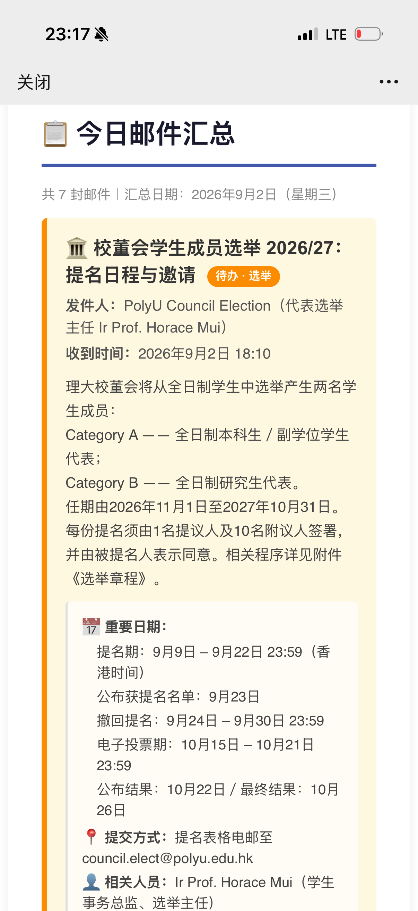
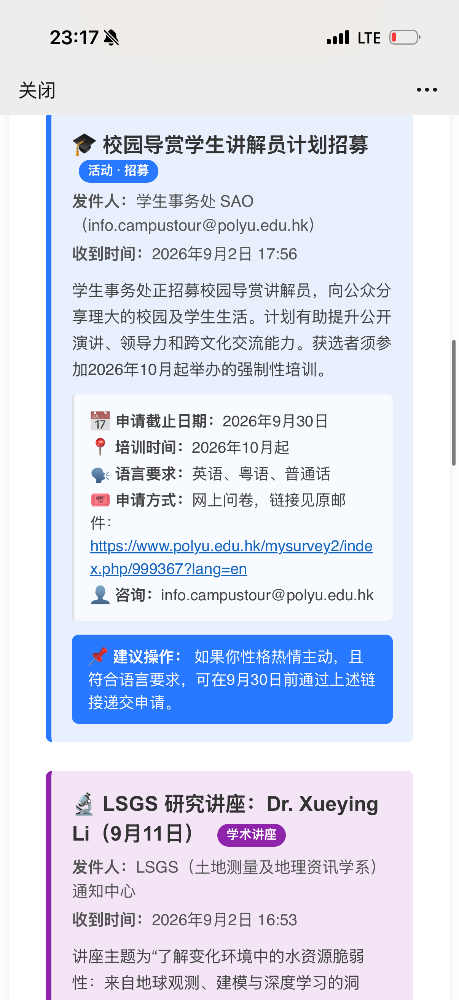

# Outlook 邮件 AI 汇总转发工作流

这是一个为解决 Outlook 邮箱信息过多、重要内容难以及时浏览而设计的 Make 工作流。

工作流会自动读取指定时间范围内的 Outlook 邮件，将邮件主题和正文交给 DeepSeek 进行整理与总结，再把生成的中文 HTML 摘要发送到指定邮箱。你可以通过一封结构清晰的汇总邮件，快速了解当天收到的通知、活动、讲座、课程待办和其他重要信息。

## 工作流程

1. 从新建的Outlook 读取邮件。
2. 聚合邮件主题、正文和原始邮件链接。
3. 使用 DeepSeek 提取重点并生成 HTML 格式的中文摘要。
4. 将摘要转发到指定邮箱。

摘要会尽量识别以下信息：

- 日期与时间
- 地点或会议方式
- 主讲人、联系人或相关人员
- 使用语言
- 报名方式、截止日期或参加条件
- 相关链接

## 实际效果展示

工作流生成的汇总邮件会使用不同颜色的卡片区分待办、活动、讲座等内容，并突出显示日期、报名方式、联系人和建议操作。

### 汇总标题与重点邮件卡片

### 活动与讲座分类卡片

## 前置准备工作

在导入和启用工作流之前，请先完成以下三个准备条件：

1. **检查并统一设置时区**
   请确认 Outlook 邮箱与 Make Scenario 的时区设置准确，并确保二者与 Filter 中使用的时区一致。当前 Blueprint 的时间计算使用 `Asia/Shanghai`；如果账号或 Scenario 使用其他时区，请同步修改 Filter，否则邮件可能被划入错误的汇总时间段。

2. **准备一个可连接 Make 的中转 Outlook 邮箱**
   学校邮箱通常需要管理员批准第三方应用连接，因此不能直接连接 Make。请先在学校邮箱中设置自动转发，将学校邮箱收到的邮件全部转发到另一个可由你自行授权的 Outlook 邮箱（仅用于接收从学生邮箱转发的邮件），再把这个 Outlook 邮箱作为本工作流的收件箱并连接到 Make。

3. **在中转 Outlook 邮箱中设置白名单**
   请将学校邮箱地址、个人学校id的邮箱地址或学校邮件域名加入新 Outlook 邮箱的白名单（安全发件人列表），并检查垃圾邮件规则，避免转发邮件被误判为垃圾邮件而无法进入汇总。

## 使用方法

1. 下载仓库中的两个 Blueprint：
   - `Outlook 邮件 AI 汇总_21点至次日13点_13点05触发.blueprint.json`
   - `Outlook 邮件 AI 汇总_13点至21点_21点05触发.blueprint.json`
2. 登录 [Make](https://www.make.com/)，新建两个 Scenario，一个json文件对应一个 Scenario。
3. 选择 **Import Blueprint**，导入下载的 JSON 文件。
4. 为两个 Microsoft Email 模块连接前置准备工作中设置的中转 Outlook 账号。
5. 为 DeepSeek 模块创建连接并填写你自己的 API Key。
6. 在发送邮件模块中，将收件地址 `generated` 改成你希望接收摘要的邮箱。
7. 设置对应的运行时间：第一份工作流为每天 `13:05`，第二份工作流为每天 `21:05`。
8. 先使用 **Run once** 测试，确认读取范围、摘要内容和收件地址正确后，再启用定时运行。

## 导入后必须修改

Blueprint 中的个人账号信息已经移除。以下内容是占位符或原账号的内部引用，导入后需要重新配置：

- Outlook 连接
- DeepSeek 连接和 API Key
- 收件地址 `generated`

## 两个时间段

| Blueprint | 目标邮件时间段 | 建议触发时间 | Outlook 初步搜索 | Filter 精确过滤 | 汇总邮件主题 |
| --- | --- | --- | --- | --- | --- |
| `Outlook 邮件 AI 汇总_21点至次日13点_13点05触发.blueprint.json` | 昨日 21:00 至今日 13:00 | 每天 13:05 | `received:yesterday OR received:today` | `receivedDateTime >= 昨日 21:00` 且 `< 今日 13:00` | `学校邮箱汇总（昨日21：00至今日13：00）` |
| `Outlook 邮件 AI 汇总_13点至21点_21点05触发.blueprint.json` | 今日 13:00 至今日 21:00 | 每天 21:05 | `received:today` | `receivedDateTime >= 今日 13:00` 且 `< 今日 21:00` | `学校邮箱汇总（今日13：00至今日21：00）` |

两份工作流配合使用，可以把一天拆分为两个汇总窗口：午间汇总负责昨日晚间至今日午间的邮件，晚间汇总负责今日午间至晚间的邮件。触发时间分别比窗口结束时间晚 5 分钟，为邮件到达和同步预留少量时间。

### 时间筛选机制

Outlook 模块先用 `received:today` 或 `received:yesterday OR received:today` 取出候选邮件，随后由模块之间的 Make Filter 根据 `receivedDateTime` 精确限制时间范围。

两个 Filter 都采用“包含起点、不包含终点”的规则：

- 午间汇总：`receivedDateTime >= 昨日 21:00` 且 `< 今日 13:00`
- 晚间汇总：`receivedDateTime >= 今日 13:00` 且 `< 今日 21:00`

因此，恰好在 13:00 收到的邮件进入晚间汇总，恰好在 21:00 收到的邮件进入下一次午间汇总。两个工作流的时间边界首尾相接，不会因为时间条件而重复收集或遗漏邮件。Filter 中的日期计算统一使用 `Asia/Shanghai` 时区。

## 其他默认设置

- 每次最多读取 100 封邮件
- 按接收时间升序排列
- 使用 DeepSeek 生成中文 HTML 摘要

如需使用其他统计时间范围，请同步修改 Outlook 过滤条件、Scenario 运行时间和汇总邮件主题，避免标题与实际数据范围不一致。

## 安全说明

此工作流读取只能读取邮件里的文字内容，邮件附件和邮件正文里的贴图都无法读取，生成摘要仅供参考

## 文件

- `Outlook 邮件 AI 汇总_21点至次日13点_13点05触发.blueprint.json`：建议每天 13:05 运行，汇总昨日 21:00 至今日 13:00 的邮件。
- `Outlook 邮件 AI 汇总_13点至21点_21点05触发.blueprint.json`：建议每天 21:05 运行，汇总今日 13:00 至 21:00 的邮件。

## License

本项目采用 [MIT License](LICENSE) 开源。你可以自由使用、复制、修改和分发本项目，但需要保留原始版权声明和许可证文本。

